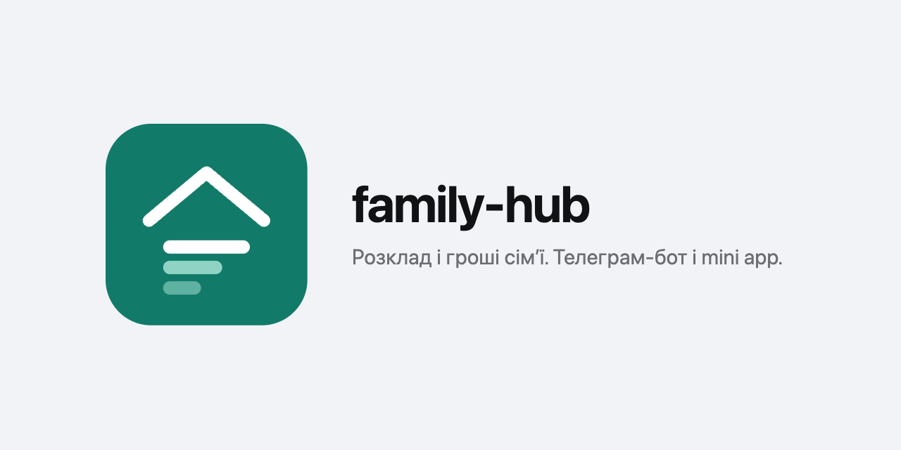

A small self-hosted app for a family's schedule and money, replacing a fragile
spreadsheet and a second bot. Two domains live in it:

- **Lessons** — recurring extracurricular courses: attendance journal,
  payments, and how many prepaid lessons are left or when a monthly pass runs
  out. Evening reminders and a per-course reconciliation view.
- **Appointments** — one-off visits: the orthodontist, a haircut, a doctor.
  Captured from plain text in Telegram via Gemini (a message like "tomorrow
  11:30 orthodontist" becomes a confirmation card, then a saved row), and
  editable afterwards on the web or the phone.

Three ways in, one SQLite file behind them: a web UI for the desk, a Telegram
bot in the family group, and a Telegram Mini App for the phone. One ICS feed
carries both kinds of events to Home Assistant.

## Why

The original spreadsheet had a few sharp edges this app removes:

- **Price changes** are first-class — bump a course price and historical
  payments stay intact, because each payment records its own amount.
- **Monthly passes** are supported alongside per-lesson billing, with correct
  coverage detection: a gap between two passes is not silently treated as paid.
- **Fast entry** — a phone-shaped form, or just a message to the bot, instead
  of fighting a spreadsheet on a small screen.

## Surfaces

| | Where | What it is for |
| --- | --- | --- |
| Web UI | behind oauth2-proxy | the whole data model: courses, payments, journal, reconciliation |
| Telegram bot | the family group | marking attendance, capturing a visit from free text, balance and spending, reminders |
| Mini App | `/mini`, inside Telegram | what is going on today, the week's visits, the weekly lesson schedule |

The Mini App authenticates the person who opened it — an HMAC over Telegram's
launch payload plus an allowlist of user ids — so it bypasses oauth without
being open.

## Domain model

- **persons** — anyone attending, child or adult.
- **enrollments** — a course a person attends. Owns the class `name`, a
  `description` to tell look-alikes apart (two "Gymnastics" with different
  trainers), `billing_type` (`per_lesson` | `monthly`), current price and a
  low-balance threshold. Identity is the row id, never the name.
- **regular_slots** — the weekly schedule of a course; drives reminders and the
  recurring ICS events.
- **visits** — one attendance event: date plus status
  (`done` / `rescheduled` / `cancelled` / `skipped`).
- **payments** — money in: either N prepaid lessons, or a date range for a
  monthly pass.
- **trainers** and **trainer_absences** — who teaches a course and their
  date-range absences, which mute reminders and punch holes in the feed.
- **appointments** — one-off events: title, who, location, start and optional
  end, status (`planned` / `done` / `cancelled`), note, cost, and the raw
  message a parse came from.

The balance dashboard rolls the lesson side up: prepaid minus attended for
per-lesson courses, and "is today covered by a paid period" for monthly passes.

## Stack

- Go (`net/http`, `html/template`)
- SQLite via `modernc.org/sqlite` (pure Go, no CGO)
- `pressly/goose` migrations, embedded
- `gopkg.in/telebot.v3` for the Telegram bot
- `google.golang.org/genai` for free-text parsing (Gemini)
- `xuri/excelize` for the one-shot spreadsheet import
- Preact and htm, vendored, for the Mini App — no build step

## Running locally

```sh
go run ./cmd/server          # serves on :8080, db at data/lessons.db
go run ./cmd/import          # (re)seed the db from a local spreadsheet
```

Flags: `-addr` (listen address), `-db` (SQLite path). Configuration is env
only — copy `.env.example` to `.env` and fill in what you need. Without
`GEMINI_API_KEY` everything works except free-text capture.

To open the Mini App in a normal browser, set `MINI_DEV_USER` to a Telegram
user id that is also in `TELEGRAM_MINI_USERS`. It skips signature verification
only, and only while no webhook URL is configured.

## Deployment

Built on the dev machine, pushed to Docker Hub, pulled on the server — no CI:

```sh
docker build -t olegsmedyuk/family-hub:latest .
docker push olegsmedyuk/family-hub:latest
# then, from the dotfiles repo:
just deploy-hetzner-tag family-hub
```

Runs as a container behind Traefik with oauth2-proxy in front, except three
paths that cannot carry an oauth session: the bot webhook (secret path), the
ICS feed (token), and `/mini` (its own per-request check).

[`DEPLOY.md`](DEPLOY.md) is the runbook — the steps above in full, plus what a
new bot needs beyond a deploy.

[`ARCHITECTURE.md`](ARCHITECTURE.md) has the data model, the deployment
pipeline (SOPS + Ansible + Docker Hub), the bot internals, operational recipes
and the open backlog.

[`docs/brand/`](docs/brand/) is the mark and the files cut from it, including
what BotFather wants.
